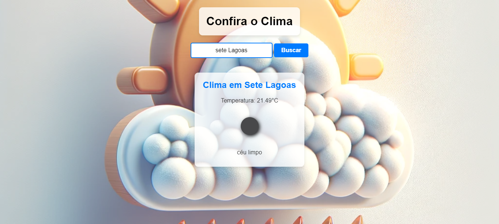

# 🌤 Clima Hoje

## 📖 Sobre o Projeto

Este projeto é uma aplicação web que permite aos usuários pesquisar e visualizar as condições climáticas atuais de qualquer cidade 🌍. Utilizando a API do OpenWeatherMap, ele exibe informações como temperatura 🌡, descrição do clima 🌬 e um ícone representativo ☀️.



## 🛠 Tecnologias Utilizadas

- HTML
- CSS
- JavaScript
- API OpenWeatherMap

## 🚀 Como Usar

1. Abra o arquivo `index.html` em um navegador.
2. Digite o nome da cidade desejada no campo de pesquisa.
3. Clique em "Buscar" para exibir o clima atual da cidade.

## ✨ Funcionalidades

- Pesquisa de clima por cidade 🏙.
- Exibição da temperatura atual, descrição do clima e um ícone representativo.
- Uso da API do OpenWeatherMap para obter dados em tempo real 🕒.

## 🔧 Instalação

Para instalar e rodar o projeto localmente, clone o repositório usando o seguinte comando:

```bash
git clone https://github.com/italogax/Clima-Hoje.git
```
## 🤝 Contribuição

Contribuições são sempre bem-vindas! Veja como contribuir:

1. Faça o Fork do projeto (🍴).
2. Crie uma Branch para sua Feature (`git checkout -b feature/AmazingFeature`).
3. Adicione suas mudanças (`git add .`).
4. Comite suas mudanças (`git commit -m 'Add some AmazingFeature'`).
5. Faça o Push da Branch (`git push origin feature/AmazingFeature`).
6. Abra um Pull Request.

## 🌐 Acesso ao Projeto

Você pode acessar o site do projeto diretamente através deste link: [Clima Hoje ao Vivo](https://italogax.github.io/Clima-Hoje/)
